# VBoS training: ML for climate change and natural disasters

Welcome to this Vanuatu Bureau of Statistics (VBoS) training course!
This Jupyter book contains notebooks on how to apply machine learning and remote sensing
methods for Climate Change Monitoring and Natural Disaster Preparedness.

## Overview of tutorials

### Part 1

::::{grid} 1 1 2 3

:::{card}
:header: **Lesson 1A**
:link: ./Lesson_1A.ipynb
Intro to Selecting and Processing Raster Data
+++
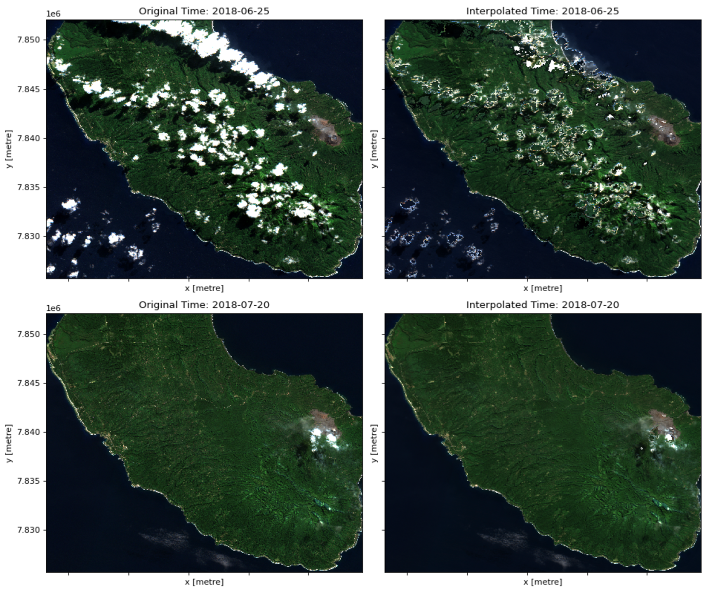
:::{note} Use CPU 30GB
{button}`Run on DEP <https://hub.digitalearthpacific.org/hub/user-redirect/git-pull?repo=git%40github.com%3AVanuatu-National-Statistics-Office%2Fclimate-change-natural-disasters&urlpath=lab%2Ftree%2Fclimate-change-natural-disasters%2Fbook%2FLesson_1A.ipynb&branch=main>`
:::

:::{card}
:header: **Lesson 1B**
:link: ./Lesson_1B.ipynb
Land Use / Land Cover Segmentation Using Sentinel-2 and Random Forest
+++
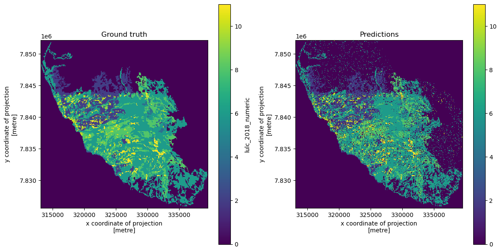
:::{note} Use CPU 30GB
{button}`Run on DEP <https://hub.digitalearthpacific.org/hub/user-redirect/git-pull?repo=git%40github.com%3AVanuatu-National-Statistics-Office%2Fclimate-change-natural-disasters&urlpath=lab%2Ftree%2Fclimate-change-natural-disasters%2Fbook%2FLesson_1B.ipynb&branch=main>`
:::

:::{card}
:header: **Lesson 1C**
:link: ./Lesson_1C.ipynb
Segmentation workflow using PyTorch for flood and water mask detection
+++
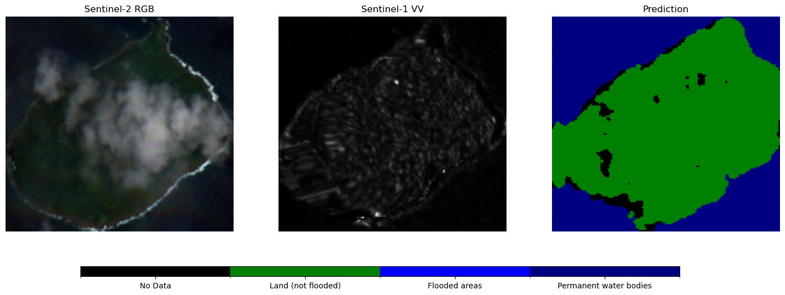
:::{note} Use CPU 30GB
{button}`Run on DEP <https://hub.digitalearthpacific.org/hub/user-redirect/git-pull?repo=git%40github.com%3AVanuatu-National-Statistics-Office%2Fclimate-change-natural-disasters&urlpath=lab%2Ftree%2Fclimate-change-natural-disasters%2Fbook%2FLesson_1C.ipynb&branch=main>`
:::

:::{card}
:header: **Lesson 1D**
:link: ./Lesson_1D.ipynb
Road segmentation
+++
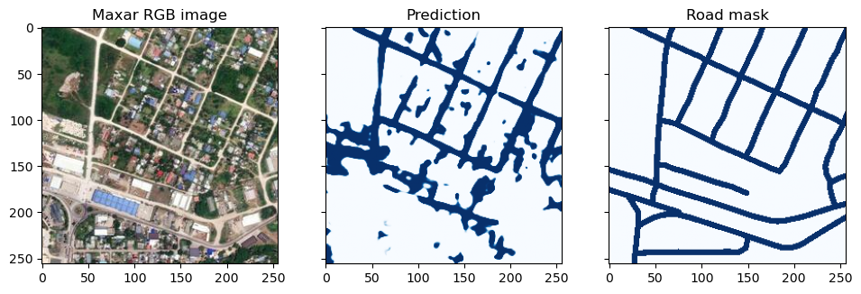
:::{tip} Use GPU 30GB
{button}`Run on DEP <https://hub.digitalearthpacific.org/hub/user-redirect/git-pull?repo=git%40github.com%3AVanuatu-National-Statistics-Office%2Fclimate-change-natural-disasters&urlpath=lab%2Ftree%2Fclimate-change-natural-disasters%2Fbook%2FLesson_1D.ipynb&branch=main>`
:::

:::{card}
:header: **Lesson 1E**
:link: ./Lesson_1E.ipynb
Full country LULC Segmentation Using GeoMedian Composite Sentinel-2 and GPU-accelerated Random Forest
+++
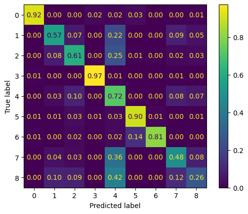
:::{hint} Use GPU 60GB
{button}`Run on DEP <https://hub.digitalearthpacific.org/hub/user-redirect/git-pull?repo=git%40github.com%3AVanuatu-National-Statistics-Office%2Fclimate-change-natural-disasters&urlpath=lab%2Ftree%2Fclimate-change-natural-disasters%2Fbook%2FLesson_1D.ipynb&branch=main>`
:::

::::

### Part 2

::::{grid} 1 1 2 3

:::{card}
:header: **Lesson 2A**
:link: ./Lesson_2A.ipynb
Coastal changes
+++
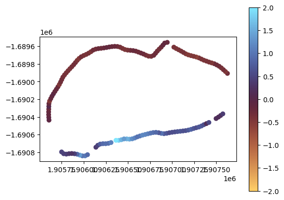
:::{note} Use CPU 30GB
{button}`Run on DEP <https://hub.digitalearthpacific.org/hub/user-redirect/git-pull?repo=git%40github.com%3AVanuatu-National-Statistics-Office%2Fclimate-change-natural-disasters&urlpath=lab%2Ftree%2Fclimate-change-natural-disasters%2Fbook%2FLesson_2A.ipynb&branch=main>`
:::

:::{card}
:header: **Lesson 2B**
:link: ./Lesson_2B.ipynb
Assessing Flood Risk from Past Weather
+++
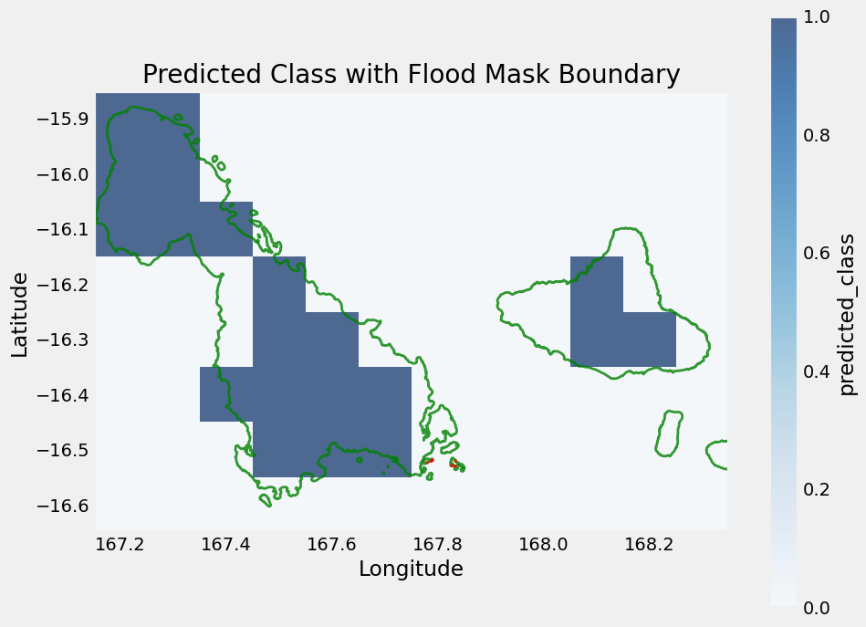
:::{important} Use CPU 60GB
{button}`Run on DEP <https://hub.digitalearthpacific.org/hub/user-redirect/git-pull?repo=git%40github.com%3AVanuatu-National-Statistics-Office%2Fclimate-change-natural-disasters&urlpath=lab%2Ftree%2Fclimate-change-natural-disasters%2Fbook%2FLesson_2B.ipynb&branch=main>`
:::

:::{card}
:header: **Lesson 2C**
:link: ./Lesson_2C.ipynb
Climate indicators
+++
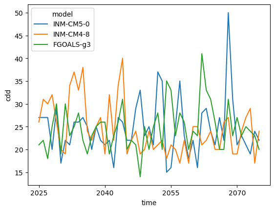
:::{note} Use CPU 30GB
{button}`Run on DEP <https://hub.digitalearthpacific.org/hub/user-redirect/git-pull?repo=git%40github.com%3AVanuatu-National-Statistics-Office%2Fclimate-change-natural-disasters&urlpath=lab%2Ftree%2Fclimate-change-natural-disasters%2Fbook%2FLesson_2C.ipynb&branch=main>`
:::

:::{card}
:header: **Lesson 2C (continued)**
:link: ./Lesson_2C_marineheatwaves.ipynb
Marine heat waves
+++
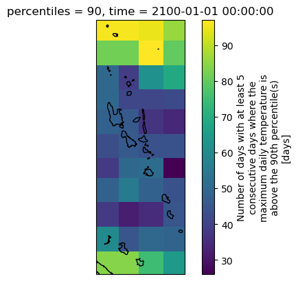
:::{important} Use CPU 60GB
{button}`Run on DEP <https://hub.digitalearthpacific.org/hub/user-redirect/git-pull?repo=git%40github.com%3AVanuatu-National-Statistics-Office%2Fclimate-change-natural-disasters&urlpath=lab%2Ftree%2Fclimate-change-natural-disasters%2Fbook%2FLesson_2C_marineheatwaves.ipynb&branch=main>`
:::

:::{card}
:header: **Lesson 2D**
:link: ./Lesson_2D.ipynb
Coral reef mapping
+++
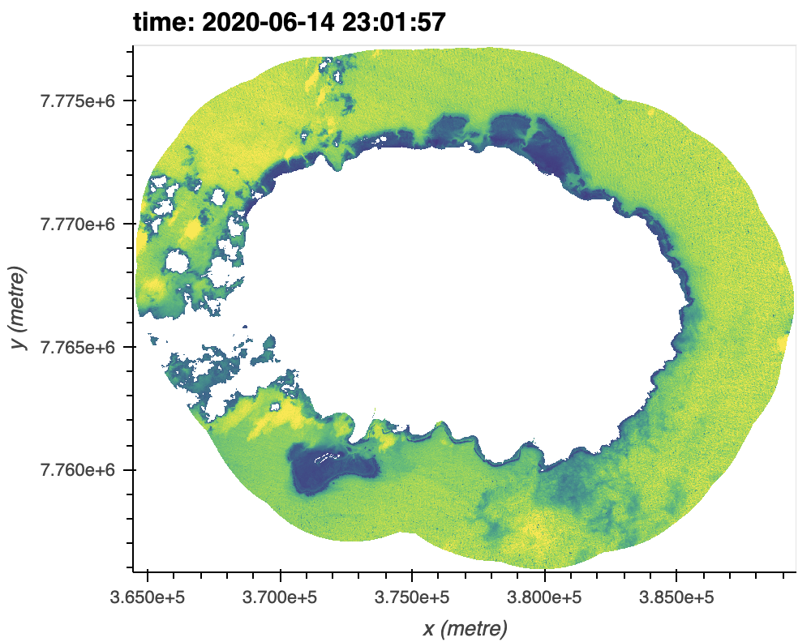
:::{important} Use CPU 60GB
{button}`Run on DEP <https://hub.digitalearthpacific.org/hub/user-redirect/git-pull?repo=git%40github.com%3AVanuatu-National-Statistics-Office%2Fclimate-change-natural-disasters&urlpath=lab%2Ftree%2Fclimate-change-natural-disasters%2Fbook%2FLesson_2D.ipynb&branch=main>`
:::

:::{card}
:header: **Lesson 2E**
:link: ./Lesson_2E.ipynb
Soil health
+++
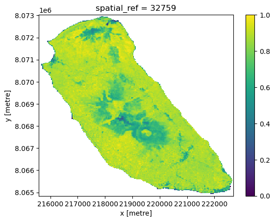
:::{important} Use CPU 60GB
{button}`Run on DEP <https://hub.digitalearthpacific.org/hub/user-redirect/git-pull?repo=git%40github.com%3AVanuatu-National-Statistics-Office%2Fclimate-change-natural-disasters&urlpath=lab%2Ftree%2Fclimate-change-natural-disasters%2Fbook%2FLesson_2E.ipynb&branch=main>`
:::

::::
